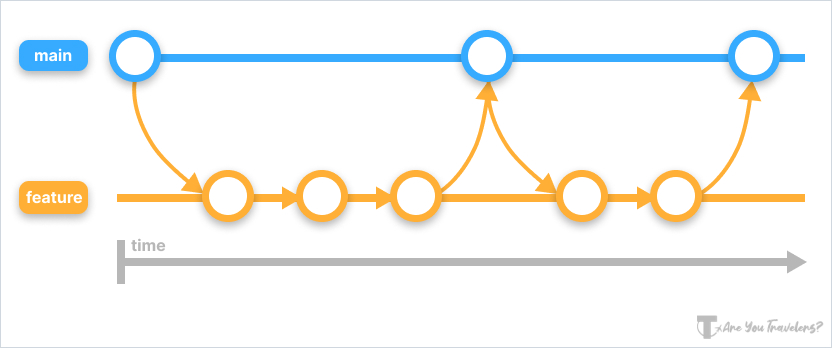
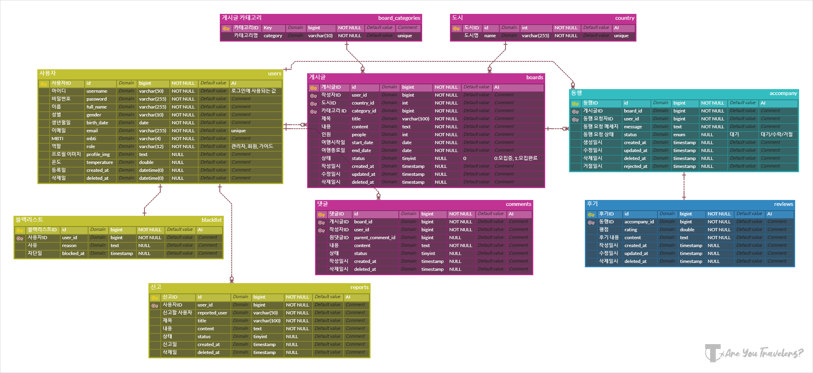
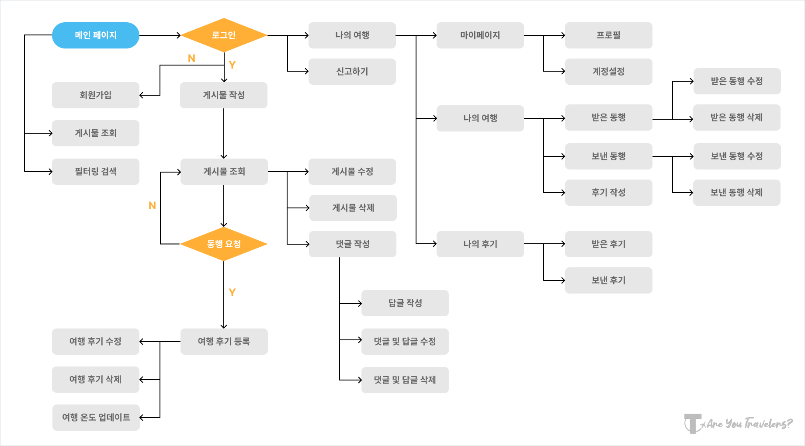
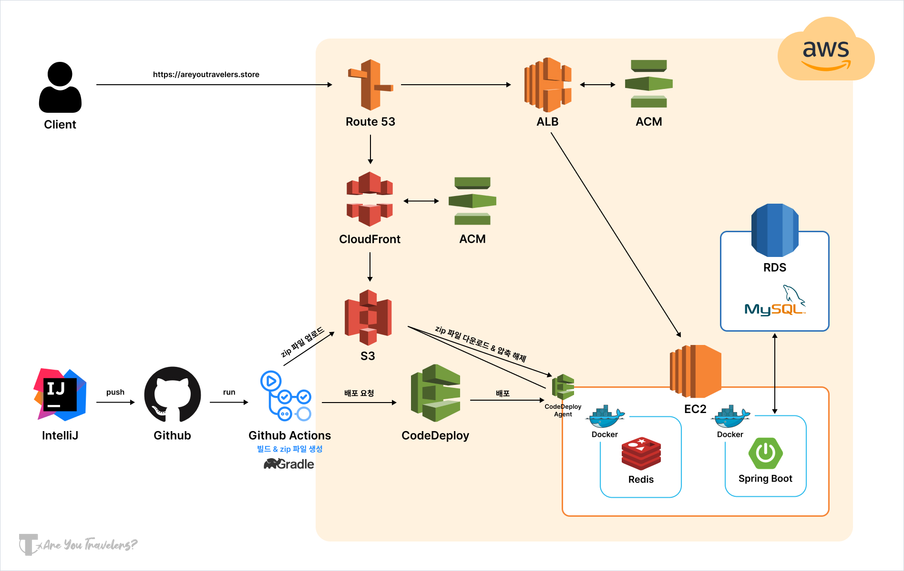

# _✈️ Are You Travelers?_
   

## **🗂️ 프로젝트 요약**
|분류|내용|
|---|---|
|주제|동행 구하기 서비스|
|팀원 구성|[👑김서현](https://github.com/se-ize) [김도훈](https://github.com/Dothur) [유채연](https://github.com/yeooniyeoon) [이예지](https://github.com/yezyaa) [최한빈](https://github.com/NamBBal)|
|개발|2023.08.09 ~ 2023.09.15|
|리팩토링|2024.05.20 ~ 2024.06.30|
|테스트용 ID/PW|traveler/1234|
|배포 링크|[🔗areyoutravelers.store](https://areyoutravelers.store/)|
|API 명세서|[🔗Link](https://www.notion.so/API-5dedc3f98af14eb89275f06b9176aa9d)|

  

## **🎯 프로젝트 개요**
### **프로젝트 주제**
다양한 지역과 나라별로 MBTI와 성향을 고려한 여행 동행자 및 개인 로컬 투어 가이드를 찾을 수 있는 온라인 서비스  

### **기획 배경**
- 코로나19 관련 규제가 완화되며 여행 수요 급증
- 팬데믹 동안 자신만의 맞춤형 여행을 선호하는 경향 증가
- 개인 성향에 맞는 여행 동행자 및 가이드를 찾아주는 서비스 부재
  

### **프로젝트 목표**
- MBTI 및 성향을 기반으로 **여행 동행자** 및 **가이드** 연결
- **여행 온도** 및 **후기**를 통해 신뢰할 수 있는 서비스 제공
- 다양한 나라의 동행자와 가이드를 통해 **문화 교류** 및 **풍부한 경험** 제공
- 여행을 좋아하는 다양한 나라의 사용자들이 모인 **다국적 커뮤니티** 형성   

## **🛠️ 개발 환경**
### 기술 스택
- FE    
- BE      
- DB  
- Infra        
- CI/CD   
- Tools         

### **패키지 구조**
[🔗Link](https://github.com/AreYouTravelers/backend/blob/main/docs/tree.md)
  

### **커밋 컨벤션**
|타입|내용|
|---|---|
|Feat|새로운 기능 추가|
|Fix|버그 수정|
|Refactor|리팩토링|
|Chore|기능 외 기타 빌드 수정|
|Docs|문서 편집|
 

### **Github Flow 전략**
   

## **📝 프로젝트 문서**
|문서|URL|
|---|---|
|ERD|[🔗Link](https://www.erdcloud.com/d/5kvEhNp2RC5TpguTo)|
|화면 설계서|[🔗Link](https://www.figma.com/file/y4NxtggXSIq4BzHiSdcLdS/AreYouTravelers%3F?type=design&mode=design&t=KJMTROHjadPj61El-0)|
|API 명세서|[🔗Link](https://www.notion.so/API-5dedc3f98af14eb89275f06b9176aa9d)|
|요구사항 정의서|[🔗Link](https://docs.google.com/spreadsheets/d/e/2PACX-1vQVrljP9sEIWozBVtbqQhPIGBbvJNRBMK0zZWDWfjcJa3LI2mSKbrVnE2JM2tMXJyhJi-g2XoPR7TdY/pubhtml?widget=true&amp;headers=false)|
|WBS|[🔗Link](https://docs.google.com/spreadsheets/d/1jiwqOm9IUyIO0H23LbWmKhMXi55cCEFRxGzutb1FegQ/edit?gid=50422208#gid=50422208)|
|단위 테스트|[🔗Link](https://documenter.getpostman.com/view/28055214/2sA3XPD3JJ#729924e2-cc05-4b0b-b643-d284db6fe61d)|
 

### **ERD**
  

### **FlowChart**
   

## **🖥️ 주요 기능 및 화면 테스트**

    
<h3>사용자</h3>

    <ul>
        <li>
            <b>회원가입</b>
            <ul>
                <li>아이디, 이름, 비밀번호, MBTI, 성별, 생년월일을 입력하여 계정 생성</li>
            </ul>
        </li>
        <li><b>로그인</b></li>
    </ul>

    
<h3>동행 구하기 및 가이드 구하기</h3>

    
<h3>댓글 및 답글</h3>

    
<h3>동행 요청 및 응답</h3>

    
<h3>후기 작성 및 여행온도</h3>

    
<h3>유저 신고</h3>

  

## **☁️ 시스템 아키텍처**
   

## **🌎 CI/CD 계획서**

------
Powered by AreYouTravelers

Website designed by 3355

© 2023 3355Corp. All rights reserved.

AreYouTravelers는 통신판매중개자이며 통신판매 당사자가 아닙니다. 상품정보 및 거래에 관한 책임은 판매자에게 있습니다.

