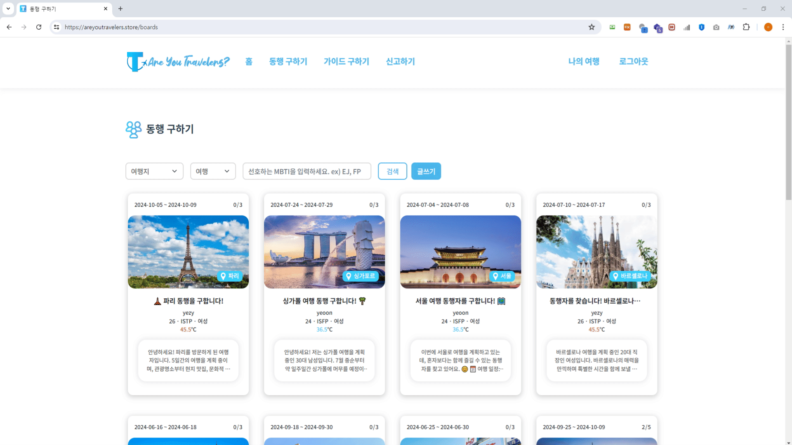
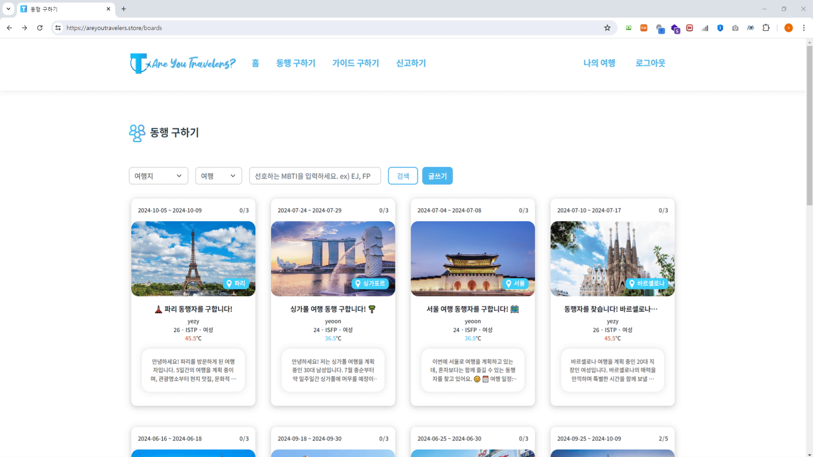
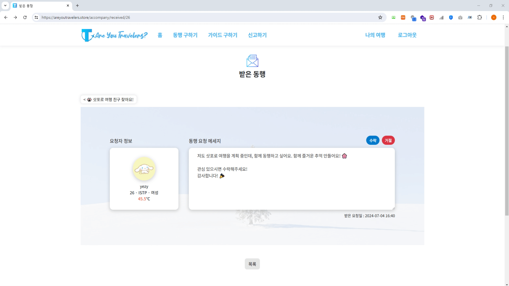
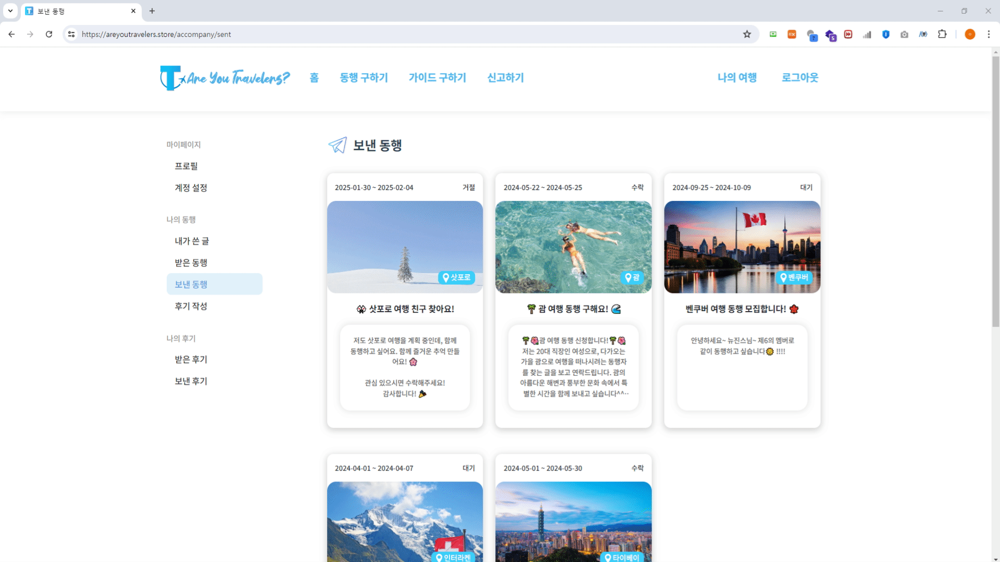

# _✈️ Are You Travelers?_
   

## **🗂️ 프로젝트 요약**
|분류|내용|
|---|---|
|주제|동행 구하기 서비스|
|팀원 구성|[👑김서현](https://github.com/se-ize) [김도훈](https://github.com/Dothur) [유채연](https://github.com/yeooniyeoon) [이예지](https://github.com/yezyaa) [최한빈](https://github.com/NamBBal)|
|개발|2023.08.09 ~ 2023.09.15|
|리팩토링|2024.05.20 ~ 2024.06.30|
|테스트용 ID/PW|traveler/1234|
|배포 링크|[🔗areyoutravelers.store](https://areyoutravelers.store/)|
|API 명세서|[🔗Link](https://www.notion.so/API-5dedc3f98af14eb89275f06b9176aa9d)|

  

## **🎯 프로젝트 개요**
### **프로젝트 주제**
다양한 지역과 나라별로 MBTI와 성향을 고려한 여행 동행자 및 개인 로컬 투어 가이드를 찾을 수 있는 온라인 서비스  

### **기획 배경**
- 코로나19 관련 규제가 완화되며 여행 수요 급증
- 팬데믹 동안 자신만의 맞춤형 여행을 선호하는 경향 증가
- 개인 성향에 맞는 여행 동행자 및 가이드를 찾아주는 서비스 부재
  

### **프로젝트 목표**
- MBTI 및 성향을 기반으로 **여행 동행자** 및 **가이드** 연결
- **여행 온도** 및 **후기**를 통해 신뢰할 수 있는 서비스 제공
- 다양한 나라의 동행자와 가이드를 통해 **문화 교류** 및 **풍부한 경험** 제공
- 여행을 좋아하는 다양한 나라의 사용자들이 모인 **다국적 커뮤니티** 형성   

## **🛠️ 개발 환경**
### 기술 스택
- FE    
- BE      
- DB  
- Infra        
- CI/CD   
- Tools         

### **패키지 구조**
[🔗Link](https://github.com/AreYouTravelers/backend/blob/main/docs/tree.md)
  

### **커밋 컨벤션**
|타입|내용|
|---|---|
|Feat|새로운 기능 추가|
|Fix|버그 수정|
|Refactor|리팩토링|
|Chore|기능 외 기타 빌드 수정|
|Docs|문서 편집|
|Design|UI 변경|
 

### **Github Flow 전략**
   

## **📝 프로젝트 문서**
|문서|URL|
|---|---|
|ERD|[🔗Link](https://www.erdcloud.com/d/5kvEhNp2RC5TpguTo)|
|화면 설계서|[🔗Link](https://www.figma.com/file/y4NxtggXSIq4BzHiSdcLdS/AreYouTravelers%3F?type=design&mode=design&t=KJMTROHjadPj61El-0)|
|API 명세서|[🔗Link](https://www.notion.so/API-5dedc3f98af14eb89275f06b9176aa9d)|
|요구사항 정의서|[🔗Link](https://docs.google.com/spreadsheets/d/e/2PACX-1vQVrljP9sEIWozBVtbqQhPIGBbvJNRBMK0zZWDWfjcJa3LI2mSKbrVnE2JM2tMXJyhJi-g2XoPR7TdY/pubhtml?widget=true&amp;headers=false)|
|WBS|[🔗Link](https://docs.google.com/spreadsheets/d/1jiwqOm9IUyIO0H23LbWmKhMXi55cCEFRxGzutb1FegQ/edit?gid=50422208#gid=50422208)|
|단위 테스트|[🔗Link](https://documenter.getpostman.com/view/28055214/2sA3XPD3JJ)|
 

### **ERD**
  

### **FlowChart**
   

## **🖥️ 주요 기능 및 화면 테스트**

    
<h3>사용자</h3>

    <ul>
        

            
<b>회원가입</b>

            <ul>
                 <li>아이디, 이름, 비밀번호, MBTI, 성별, 생년월일을 입력하여 계정 생성</li> 
                
            </ul>
        

        

            
<b>회원 로그인 & 로그아웃</b>

            <ul>
                 <li>로그인 시 access token과 Redis를 이용한 refresh 토큰으로 로그인 유지</li>
                <li>로그아웃 시 token 무효화</li> 
                
            </ul>
        

        

            
<b>회원정보 조회 & 수정</b>

            <ul>
                 <li>마이페이지에서 본인 프로필 조회</li>
                <li>프로필 이미지, MBTI, Email 수정</li> 
                
            </ul>
        

        

            
<b>비밀번호 변경</b>

            <ul>
                 <li>현재 비밀번호, 새로운 비밀번호, 새로운 비밀번호 확인을 입력 후 비밀번호 변경 가능</li>
                <li>비밀번호 변경 시 현재 계정 로그아웃</li> 
                
            </ul>
        

        

            
<b>회원 탈퇴</b>

            <ul>
                 <li>비밀번호 입력 후 회원 탈퇴</li> 
                
            </ul>
        

    </ul>

    
<h3>관리자</h3>

    <ul>
        

            
<b>관리자 로그인 & 회원 조회 & 탈퇴</b>

            <ul>
                 <li>admin 계정으로 로그인 시 관리자 페이지로 연결</li>
                <li>회원 관리 페이지에서 회원 리스트 조회</li>
                <li>관리자 권한으로 특정 회원 탈퇴</li> 
                
            </ul>
        

    </ul>

    
<h3>동행 및 가이드 구하기</h3>

    <ul>
        

            
<b>‘동행 구하기’ 게시글 작성</b>

            <ul>
                 <li>로그인 후 여행지, 시작일, 종료일, 모집 인원, 제목, 내용을 입력하여 ‘동행 구하기’ 게시글 작성</li> 
                
            </ul>
        

        

            
<b>‘동행 구하기’ 게시글 필터링 검색</b>

            <ul>
                 <li>선호하는 여행지와 MBTI로 필터링 검색</li>
                <li>MBTI의 특정 알파벳으로 조회 가능</li> 
                
            </ul>
        

        

            
<b>‘동행 구하기’ 게시글 상세 조회 & 수정</b>

            <ul>
                 <li>상세 조회 시 여행지, 여행일자, 글 작성자, 신청자, 현재 인원, 모집 인원 등 조회 가능</li>
                <li>내가 작성한 ‘동행 구하기’ 게시글에서 모집 인원, 제목, 내용 수정 가능</li> 
                
            </ul>
        

        

            
<b>‘동행 구하기’ 게시글 삭제</b>

            <ul>
                 <li>내가 작성한 ‘동행 구하기’ 게시글 상세 조회에서 삭제 가능</li> 
                
            </ul>
        

        

            
<b>‘가이드 구하기’ 게시글 작성</b>

            <ul>
                 <li>로그인 후 여행지, 시작일, 종료일, 여행 인원, 제목, 내용을 입력하여 ‘가이드 구하기’ 게시글 작성</li> 
                
            </ul>
        

        

            
<b>‘가이드 구하기’ 게시글 필터링 검색 & 상세 조회 & 수정</b>

            <ul>
                 <li>가이드의 주력 여행지와 선호하는 MBTI로 필터링 검색</li>
                <li>MBTI의 특정 알파벳만으로도 조회 가능</li>
                <li>‘가이드 구하기’ 게시글 상세 조회 시 글 작성자, 여행 인원, 글 내용 조회 가능</li>
                <li>내가 작성한 ‘가이드 구하기’ 게시글에서 여행 인원, 제목, 내용 수정 가능</li> 
                
            </ul>
        

        

            
<b>‘가이드 구하기’ 게시글 삭제</b>

            <ul>
                 <li>내가 작성한 ‘가이드 구하기’ 게시글 삭제</li> 
                
            </ul>
        

    </ul>

    
<h3>댓글 및 답글</h3>

    <ul>
        

            
<b>댓글 및 답글 작성</b>

            <ul>
                 <li>특정 게시글에서 댓글 조회 후 새로운 댓글 작성 가능</li>
                <li>댓글 조회 후 답글쓰기 버튼 클릭하여 답글 작성</li> 
                
            </ul>
        

        

            
<b>댓글 조회 & 수정</b>

            <ul>
                 <li>게시글(동행 구하기, 가이드 구하기)에서 댓글 버튼 클릭하여 조회</li>
                <li>댓글 조회 시 댓글 작성자, 댓글 작성자 프로필 이미지, 댓글 내용, 댓글 작성일시 조회 가능</li>
                <li>댓글 조회 후 수정 버튼 클릭하여 댓글 내용 수정 가능</li> 
                
            </ul>
        

        

            
<b>댓글 삭제</b>

            <ul>
                 <li>댓글 조회 후 삭제 버튼 클릭하여 댓글 삭제</li>
                <li>부모 댓글이 있는 경우, 부모 댓글 삭제 시 자식 댓글도 모두 삭제</li> 
                
            </ul>
        

    </ul>

    
<h3>동행 요청 및 응답</h3>

    <ul>
        

            
<b>동행 요청</b>

            <ul>
                 <li>‘동행 구하기’ 게시글에서 ‘동행 요청하기’ 가능</li>
                <li>이미 동행 요청을 한 게시글에는 중복 요청 불가능</li> 
                
            </ul>
        

        

            
<b>받은 동행 전체 조회 & 상세 조회</b>

            <ul>
                 <li>내가 작성한 ‘동행 구하기’ 게시글에 대한 동행 요청 전체 조회</li>
                <li>탈퇴된 회원의 동행 요청은 조회 불가</li>
                <li>상세 조회 시 동행 요청자 정보, 동행 요청 메세지, 요청 일시 조회 가능</li>
                <li>상세 조회 시 내가 작성한 ‘동행 구하기’ 원본 게시글로 이동 가능</li> 
                
            </ul>
        

        

            
<b>받은 동행 응답</b>

            <ul>
                 <li>요청자 정보와 동행 요청 메세지를 확인 후 응답 상태를 수락/거절로 업데이트</li>
                <li>기본 응답 상태는 대기이며, 응답 상태에 따라 모집된 인원 증감</li> 
                
            </ul>
        

        

            
<b>보낸 동행 전체 조회 & 상세 조회</b>

            <ul>
                 <li>내가 보낸 ‘동행 요청’ 게시글 리스트 전체 조회</li>
                <li>원본 게시글 작성자가 탈퇴한 경우 내가 쓴 글 조회 불가</li>
                <li>상세 조회 시 내가 보낸 동행의 원본 게시글, 응답 상태, 응답 시간, 동행 요청 메세지 조회 가능</li>
                <li>보낸 동행의 원본 게시글이 삭제 시 원본 게시글 조회 불가</li> 
                
            </ul>
        

        

            
<b>보낸 동행 수정</b>

            <ul>
                 <li>응답 상태가 대기인 경우만 수정 가능하며, 응답 받은 요청(수락/거절)은 수정 불가</li>
                <li>수정 시 최근 작성일에 수정 시간 반영</li> 
                
            </ul>
        

        

            
<b>보낸 동행 삭제</b>

            <ul>
                 <li>응답 상태가 거절/대기인 경우 또는 원본 게시글이 삭제된 경우 보낸 동행 게시글 삭제 가능</li> 
                
            </ul>
        

    </ul>

    
<h3>후기 작성 및 여행온도</h3>

    <ul>
        

            
<b>후기 작성 & 온도 변화</b>

            <ul>
                 <li>보낸 동행 중 여행 종료일이 현재 날짜보다 이전인 경우 후기 작성 가능</li>
                <li>별점과 메세지 작성 가능</li>
                <li>부여한 별점에 따라 후기를 받은 사용자의 여행 온도 변화</li> 
                
            </ul>
        

        

            
<b>받은 후기 전체 조회 & 상세 조회</b>

            <ul>
                 <li>동행자들이 작성한 후기 전체 조회 가능</li>
                <li>상세 조회 시 동행자들이 작성한 후기 메세지와 별점 조회</li> 
                
            </ul>
        

        

            
<b>보낸 후기 전체 조회 & 상세 조회</b>

            <ul>
                 <li>내가 작성한 후기 전체 조회 가능</li>
                <li>상세 조회 시 여행 기간, 동행 게시글 제목, 내가 작성한 메세지와 별점 조회 가능</li> 
                
            </ul>
        

        

            
<b>보낸 후기 수정</b>

            <ul>
                 <li>기존에 작성했던 별점과 메세지 수정 가능</li> 
                
            </ul>
        

        

            
<b>보낸 후기 삭제</b>

            <ul>
                 <li>후기 상세 조회에서 삭제 가능</li> 
                
            </ul>
        

    </ul>

    
<h3>사용자 신고</h3>

    <ul>
        

            
<b>사용자 신고</b>

            <ul>
                 <li>사용자 아이디와 제목, 내용을 입력하여 사용자 신고 가능</li>
                <li>신고 내역은 관리자가 확인 가능하고, 관리자 확인 후 처리</li> 
                
            </ul>
        

    </ul>

 

## **☁️ 시스템 아키텍처**
  

### **배포 과정**
Git Push → Github Actions 동작 → AWS S3 zip파일 업로드 → AWS CodeDeploy 배포 → AWS EC2에서 SpringBoot와 Redis 도커 컨테이너 실행
  

### **사용자 요청 흐름**
도메인 접속 → AWS Route 53을 통한 ALB 라우팅 → ALB가 트래픽을 EC2로 분배 → EC2에서 동적 파일 반환 → CloudFront에서 정적 파일 반환
   

## **🌎 CI/CD 계획서**
### **인프라 구성**
<b></b>
<ul>
</ul>
<b>1. AWS Route 53</b>
<ul>
    <li>S3, CloudFront, ELB 등의 서비스와 통합하여 전체 아키텍처의 관리와 배포를 용이하게 하기 위해 사용</li>
    <li>Route 53에 A 레코드로 ALB 등록하여, 도메인으로 들어온 요청을 DNS 호스팅 후 ALB로 라우팅</li>
</ul>
<b>2. AWS ELB(Elastic Load Balancer) - ALB(Application Load Balancer)</b>
<ul>
    <li>애플리케이션 서버에서 직접 SSL 인증서를 관리하는 대신, ALB를 통해 HTTPS 통신을 처리하고 SSL 인증서 관리</li>
    <li>서비스 확장성을 고려하여 사용</li>
    <li>Auto Scaling과 통합하여, 트래픽 증가 시 자동으로 확장되는 EC2 인스턴스 그룹의 트래픽을 효과적으로 분산</li>
</ul>
<b>3. AWS S3 & AWS CloudFront</b>
<ul>
    <li>프로젝트 빌드 파일 및 배포 파일을 압축하여 S3에 업로드</li>
    <li>정적 컨텐츠를 S3에 저장하고 CloudFront를 통해 배포하여, 분산된 엣지 로케이션을 통해 정적 컨텐츠를 빠르게 제공</li>
</ul>
<b>4. Github Actions & AWS CodeDeploy</b>
<ul>
    <li>Github Actions를 사용해 코드 변경 시 자동으로 워크플로우 트리거</li>
    <li>CodeDeploy가 배포 지침을 전송할 때, CodeDeploy Agent는 S3에 저장된 zip 파일을 받아 EC2와 상호작용하여 배포 수행</li>
    <li>GitHub Actions와 AWS CodeDeploy를 함께 사용해 개발부터 배포까지의 파이프라인을 자동화하고 최적화하여 개발 속도와 품질을 향상</li>
</ul>
<b>5. Docker</b>
<ul>
    <li>OS에 상관없이 동일한 환경을 쉽게 구성하고 배포 가능</li>
    <li>가상머신이 아닌 컨테이너 기반의 가벼운 가상화 기술로, 하드웨어 자원을 효율적으로 사용</li>
    <li>Dockerfile을 통해 개별 컨테이너 이미지 생성 후, Docker Compose를 사용하여 이미지를 기반으로 복잡한 멀티 컨테이너 애플리케이션의 서비스 오케스트레이션 구현</li>
</ul>
<b>6. AWS RDS(MySQL) & Redis</b>
<ul>
    <li>데이터베이스 인프라를 자동으로 관리하기 위해 AWS RDS 사용. 이는 백업, 패치, 복제, 장애 복구 자동화 지원</li>
    <li>Redis를 캐시 서버로 사용해 서비스 속도를 올리고, 데이터베이스 부하를 줄이기 위해 사용</li>
    <li>로그인 시 발급되는 refresh 토큰을 Redis에 저장하여 빠른 액세스 속도를 제공하고 일정 시간 이후 만료되도록 구현</li>
    <li>자주 변경되지 않는 게시글 카테고리를 Redis에 저장하여 조회 속도 향상</li>
</ul>
 

### **보안**
<b></b>
<ul>
</ul>
<b>1. IAM(Identity and Access Management)</b>
<ul>
    <li>외부 서비스인 Github Actions에서 AWS 서비스에 접근하기 위해 사용자 권한 부여</li>
    <li>IAM을 통해 AWS 리소스에 대한 액세스 권한을 부여/제한하여 보안 관리 중앙화</li>
</ul>
<b>2. ACM(AWS Certificate Manager)</b>
<ul>
    <li>AWS에서 인증서 관리는 ACM 서비스가 담당하며, ALB 및 CloudFront와 통합하여 HTTPS 통신 보호</li>
    <li>SSL/TLS 인증서를 쉽게 발급(프로비저닝), 관리 및 배포할 수 있도록 지원</li>
</ul>
  

------
Powered by AreYouTravelers 
Website designed by 3355 
© 2023 3355Corp. All rights reserved. 
AreYouTravelers는 통신판매중개자이며 통신판매 당사자가 아닙니다. 상품정보 및 거래에 관한 책임은 판매자에게 있습니다. 

